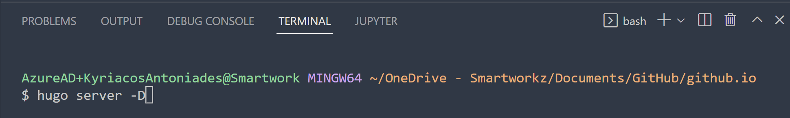

# Hugo on GitHub Pages with Forestry and Netlify

[](https://app.netlify.com/sites/smartworkz/deploys)


Smartworkz's static (web) site is based on the following integrations:

- [Hugo](https://gohugo.io/) a static site generator installed on your local machine for rapid static site design and development
- [Github](https://github.com/) to store backups
- [Forestry](https://forestry.io/) a static site CMS hosted service for daily content creation/editing
- [Netlify](https://www.netlify.com/) a static file hosting serviice to watch Github for any changes and build/deploy as needed

  

## Prerequisites

* If not already done, *Install [Hugo](https://gohugo.io/getting-started/installing/)*
* If not already done, *Install [Visual Studio Code](https://code.visualstudio.com/download) (VSC)*
* If not already done, *Install [Git Bash](https://git-scm.com/downloads)*
* *(Optional) Configure Git Bash as the default terminal for VSC*

  1. Click View, Terminal
  2. After the Terminal appears, press the F1 key
  3. Type the following, Terminal: Select Default Profile
  4. Select from the dropdown, Git Bash

## Hugo and GitHub Pages

### *Navigate to your local Git repository*


### `cmd` *in your File Explorer path and press the Enter key*


The command window prompt opens:


### `code .` *in the prompt and press the Enter key*


The Visual Studio Code (VSC) application opens

* *Trust the Authors and on the Menu click View and select Terminal*

  

  The Git Bash terminal appears:

  

### Clone a Hugo Template of this site

```
This contains all the files used to generate the site, not the site itself.
Later, will create another separate repository to host the static (web) site files
```


`git clone https://github.com/smartworkz-kyriacos/smartworkz-site.git`

This clones the repository in the local git repository path


### *`cd` into site*


`cd smartworkz-site`

### *Check status*


`git status`

### *Check directory structure*


```
ls
ls -la
```

### *Check smartworkz-site tree view*

### *Open and log in to your [GitHub account](https://github.com/)*

### *Create a GitHub repository for the generated static (web) site files*


The name of this repository follows the format

`<USERNAME>`.`github.io`

Replace with your own `<USERNAME>`

Return to the terminal and change to the local Git directory for your `<USERNAME>`.`github.io` hosting site `cmd` in and `code .` to open in VSC


### Clone your previous GitHub Repository

(Smartworkz's template containing all static (web) files in your  `<USERNAME>`.`github.io` local Git repository)

  `git clone https://github.com/smartworkz-kyriacos/smartworkz-site.git`


### *Check that the template site is functioning*



 `hugo server -D`

This will set up the site locally and allow it to be viewed at the address specified in the shell (http://localhost:1313). Observe the `/public` folder created:


### *Generate the static files and push it to the `<USERNAME>.github.io` repository*

1. Remove the `public` directory in case as it was created with Hugo previously

   `rm -rf public`
2. Generate the actual website files in your site project directory in a subdirectory called `public/` with a submodule repository (**note:** *below is a one-line code*)

   `git submodule add -b main https://github.com/<USERNAME>/<USERNAME>.github.io.git public`

Git submodules are  nested repositories. By making the `.github.io` repository a submodule of the `smartworkz-site` repository, we' re replicating the structure Hugo uses by making the rendered website files in a `/public/` subdirectory inside the site project directory `smartworkz-site` itself.

### *Deploy to `<USERNAME>`.`github.io` by running the following commands:*

```
hugo
cd public
git add .
git commit -m "write a commit message here to describe the changes"
git push origin main
```

### *Automate deployment by creating a bash file `deploy.sh` file*

```
#!/bin/sh

# If a command fails then the deploy stops
set -e

printf "\033[0;32mDeploying updates to GitHub...\033[0m\n"

# Build the project.
hugo # if using a theme, replace with `hugo -t <YOURTHEME>`

# Go To Public folder
cd public

# Add changes to git.
git add .

# Commit changes.
msg="rebuilding site $(date)"
if [ -n "$*" ]; then
	msg="$*"
fi
git commit -m "$msg"

# Push source and build repos.
git push origin master
```

### *Run deployment by typing:*

`./deploy.sh "write a commit message here to describe the changes you made"`

Changes will be live shortly at your  `https://<USERNAME>.github.io` with any changes everytime you deploy your GitHub Pages

## Hugo and Forestry Integration

### *Open and log in to your [Forestry account](https://forestry.io/)*


### *Click Add Site, Select Hugo as your static site generator*


### Select GitHub as your git provider


### *Choose Git repository*


GitHub Pages hosts  your website using Hugo and Forestry.io as your CMS. Any changes you make using Forestry will auto-commit to your project repository.


### *`git pull` once you're done editing your site content with Forestry.*

## Hugo and Netlify Integration

Netlify can host your Hugo site with CDN, continuous deployment, 1-click HTTPS, an admin GUI, and its own CLI.

[Netlify](https://www.netlify.com/) provides continuous deployment services, global CDN, ultra-fast DNS, atomic deploys, instant cache invalidation, one-click SSL, a browser-based interface, a CLI, and many other features for managing your Hugo website.

### Assumptions

* You have an account with GitHub, GitLab, or Bitbucket.
* You have completed the [Quick Start](https://gohugo.io/getting-started/quick-start/) or have a Hugo website you are ready to deploy and share with the world.
* You do not already have a Netlify account.

### Create a Netlify account

Go to [app.netlify.com](https://app.netlify.com/) and select your preferred signup method. This will likely be a hosted Git provider, although you also have the option to sign up with an email address.

The following examples use GitHub, but other git providers will follow a similar process.


Selecting GitHub will bring up an authorization modal for authentication. Select “Authorize application.”


### Create a New Site with Continuous Deployment

You're now already a Netlify member and should be brought to your new dashboard. Select New site from git.


Netlify will then start walking you through the steps necessary for continuous deployment. First, you’ll need to select your git provider again, but this time you are giving Netlify added permissions to your repositories.


And then again with the GitHub authorization modal:


Select the repo you want to use for continuous deployment. If you have a large number of repositories, you can filter through them in real time using repo search:


Once selected, you’ll be brought to a screen for basic setup. Here you can select the branch you wanted published, your [build command](https://gohugo.io/getting-started/usage/#the-hugo-command), and your publish (i.e. deploy) directory. The publish directory should mirror that of what you've set in your [site configuration](https://gohugo.io/getting-started/configuration/), the default of which is `public`. The following steps assume you are publishing from the `master` branch.

### Configure Hugo Version in Netlify

You can [set Hugo version](https://www.netlify.com/blog/2017/04/11/netlify-plus-hugo-0.20-and-beyond/) for your environments in `netlify.toml` file or set `HUGO_VERSION` as a build environment variable in the Netlify console.

For development `netlify.toml`:

```toml
[build]
  publish = "public"
  command = "hugo --gc --minify"
  
[build.environment]
  HUGO_VERSION = "0.84.1"
  HUGO_THEME = "educenter"
```

### Build and Deploy Site

In the Netlify console, selecting “Deploy site” will immediately take you to a terminal for your build:.


Once the build is finished—this should only take a few seconds–you should now see a “Hero Card” at the top of your screen letting you know the deployment is successful. The Hero Card is the first element that you see in most pages. It allows you to see a quick summary of the page and gives access to the most common/pertinent actions and information. You’ll see that the URL is automatically generated by Netlify. You can update the URL in “Settings.”


[Visit the live site](https://smartworkz.netlify.app/)

Now every time you push changes to your hosted git repository, Netlify will rebuild and redeploy your site.

See [this blog post](https://www.netlify.com/blog/2017/04/11/netlify-plus-hugo-0.20-and-beyond/) for more details about how Netlify handles Hugo versions.

### Next Steps

You now have a live website served over HTTPS, distributed through CDN, and configured for continuous deployment. Dig deeper into the Netlify documentation:

1. [Using a Custom Domain](https://www.netlify.com/docs/custom-domains/)
2. [Setting up HTTPS on Custom Domains](https://www.netlify.com/docs/ssl/)
3. [Redirects and Rewrite Rules](https://www.netlify.com/docs/redirects/)
